# 💰🤝Donatify - A Fundraising Platform
Donatify is a powerful all-in-one fundraising and donation management platform designed to connect donors with impactful causes in a fast, secure and transparent way. Whether you're an organization raising funds, an individual in need or a compassionate donor wanting to make a difference, Donatify offers the right tools to make your journey effortless. Built with Flutter for a smooth, cross-platform experience and integrated with Firebase and Supabase for a secure and scalable backend. Donatify streamlines the entire donation lifecycle, from campaign creation to fund allocation, all within a user-friendly, mobile-first environment.

---
##🔑Key Features

###💰👤For Donors
-🛡️Secure signup/login
-🏠 Browse donation campaigns by category
-💳 Donate using popular payment methods (Bkash, Nagad)
-📱 View donation history and track contributions

###💰👤For Receivers
-🛡️Secure signup/login
-➕ Create donation requests with details
-📊 Track request status (Pending/Approved/Rejected)
-📈 Monitor donation progress
-🧾 Submit required documents for verification

###👨🏻‍💻For Admins
-🛡️Secure login with specific mail and password(Contact developer for admin access)
-👁️‍🗨️ Review and manage donation requests
-📊 View donation statistics
-🗂️ Organize requests by category
-🔍 Verify attached documents

---

##🛠️Tech Stack💻
-Frontend: Flutter (Dart)
-Backend: Firebase (Cloud Firestore, Authentication)
-File Storage: Supabase
-State Management: Provider
-Animations: flutter_animate
-Image Handling: image_picker
-Platform: Android Only

---

##Getting Started 🚀

###Prerequisites
-Flutter SDK (v3.0 or later)
-Dart SDK
-Firebase Project
-Supabase Project

###Installation Steps
1. Clone the Repository
```bash
git clone https://github.com/  
cd YOUR_REPO_NAME

2.Install dependencies
```bash
flutter pub get

3.Configure Firebase
-Create Firebase project
-Add Android App
-Download google-services.json and place inside android/app/
-Enable Email/Password authentication
4.Configure Supabase
-Create Supabase project
-Create storage bucket named "donatify"
-Update supabase_service.dart with your credentials:
await Supabase.initialize(
  url: 'YOUR_SUPABASE_URL',
  anonKey: 'YOUR_SUPABASE_ANON_KEY',
);
5.Run the app
```bash
flutter run

---

##Project Structure 🗂️
lib/
├── auth/                   # Authentication screens
│   ├── login_screen.dart
│   ├── signup_screen.dart
│   └── user_selection.dart
├── donor/                  # Donor features
│   ├── donor_dashboard.dart
│   └── payment_screen.dart
├── receiver/               # Receiver features
│   ├── receiver_dashboard.dart
│   └── receiver_donation_form.dart
├── admin/                  # Admin features
│   └── admin_dashboard.dart
├── common/                 # Shared components
│   ├── donation_details.dart
│   └── models/
├── services/               # Backend services
│   ├── firebase_service.dart
│   ├── supabase_service.dart
│   └── app_auth_provider.dart
├── main.dart               # App entry point
└── splash_screen.dart      # Initial screen

##Features snapshot📸

###Authentication Flow

| 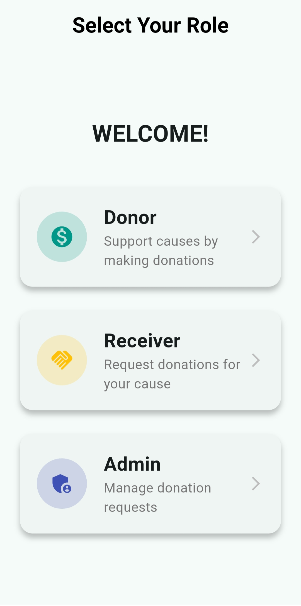 | 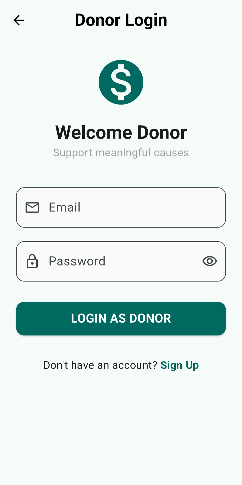 | 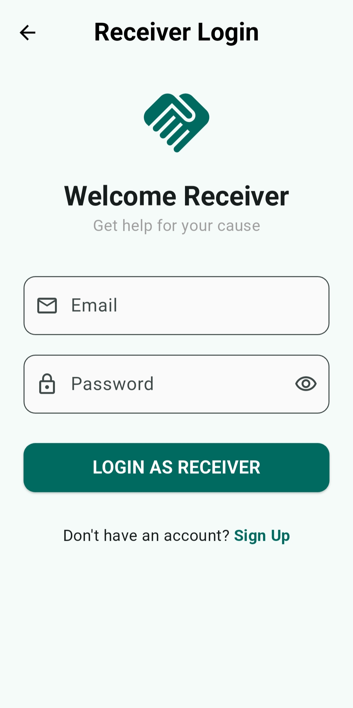 |
|:--:|:--:|:--:|
| *Role Selection* | *Donor Login* | *Receiver Login* |

| 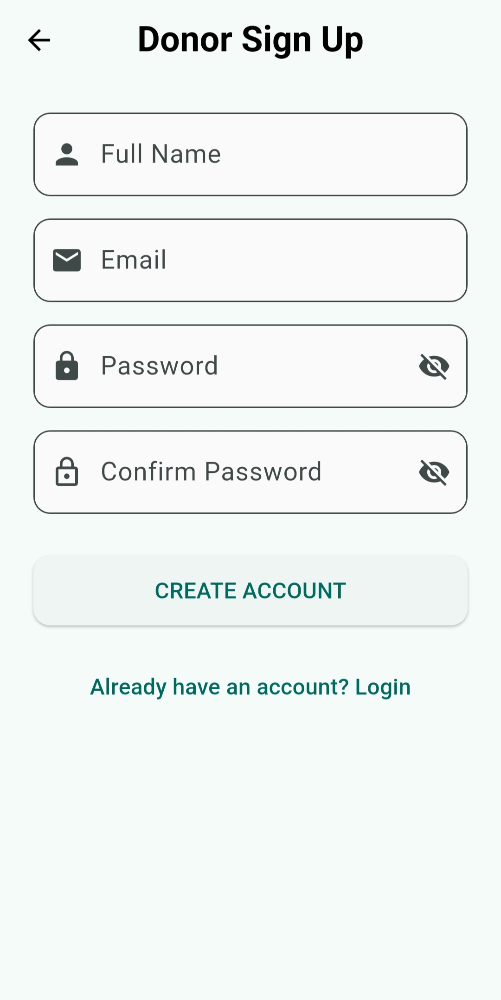 | 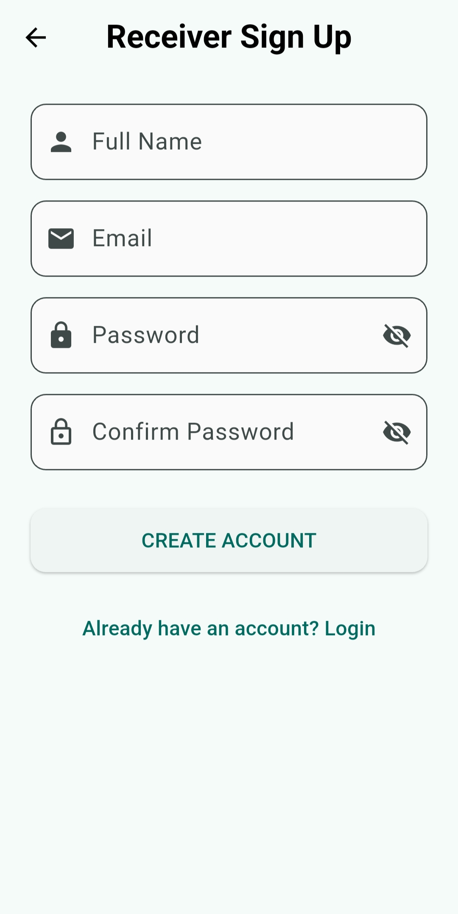 |
|:--:|:--:|
| *Donor Signup* | *Receiver Signup* |
### Donor Experience
| 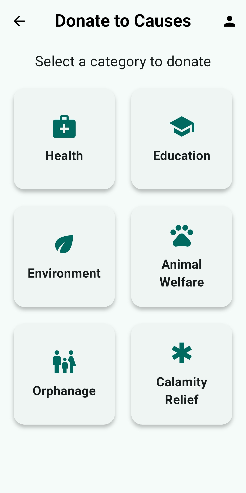 | 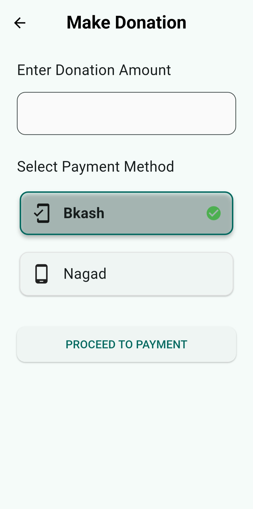 |
|:--:|:--:|
| *Donor Dashboard* | *Payment Process* |
### Receiver Experience
| 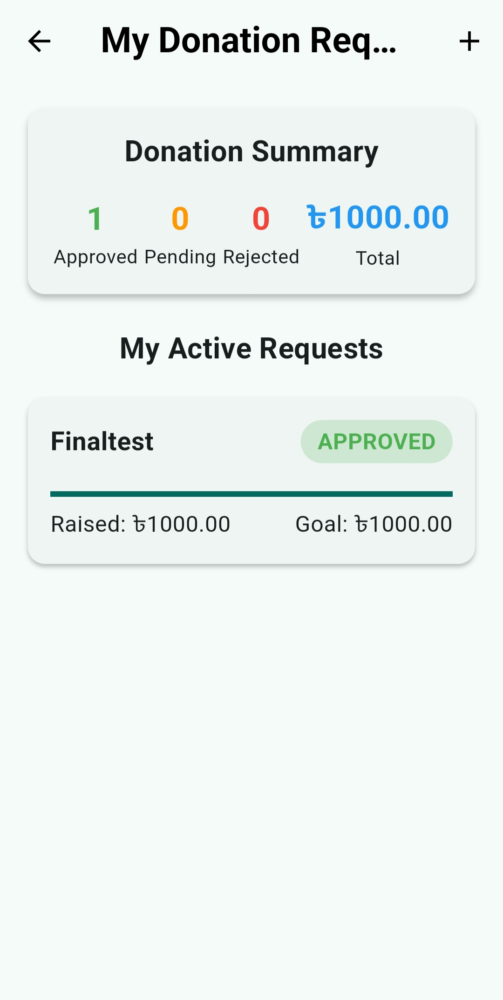 | 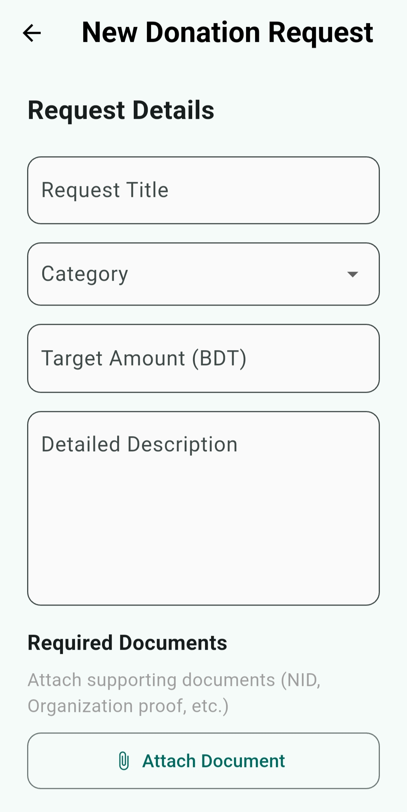 |
|:--:|:--:|
| *Receiver Dashboard* | *Donation Request Form* |
### Admin Experience
| 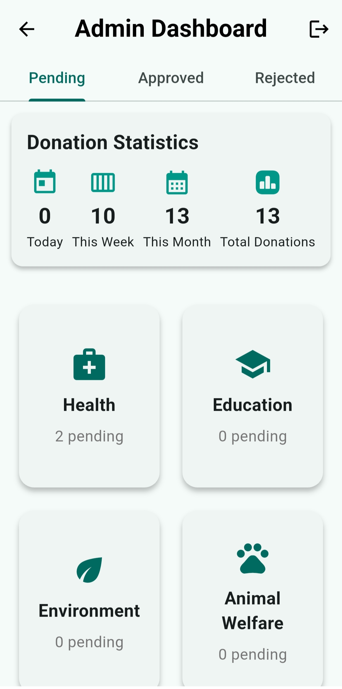 | 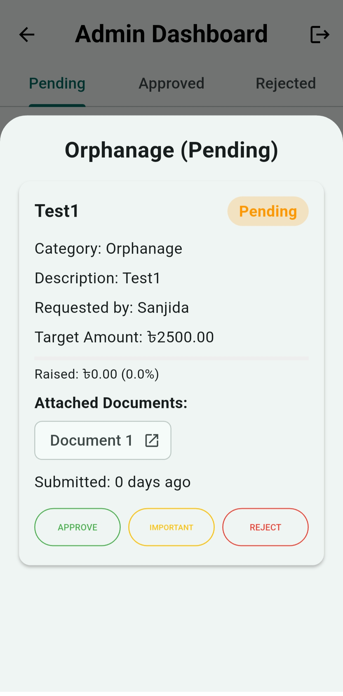 |
|:--:|:--:|
| *Admin Dashboard* | *Request Approval* |

##Dependencies 📦

dependencies:
  flutter:
    sdk: flutter
  cupertino_icons: ^1.0.2
  firebase_core: ^2.24.0
  firebase_auth: ^4.19.0
  cloud_firestore: ^4.16.0
  provider: ^6.0.5
  flutter_animate: ^4.1.1+1
  image_picker: ^1.0.4
  supabase_flutter: ^2.1.0
  intl: ^0.18.1
  iconsax_flutter: ^1.0.0

  ##Contact 📞
  
  Developer: Sanjida Tabassum
  -📧 Email: sanjidaesha578@gmail.com
  -💼 GitHub: Sanjidaaaa578