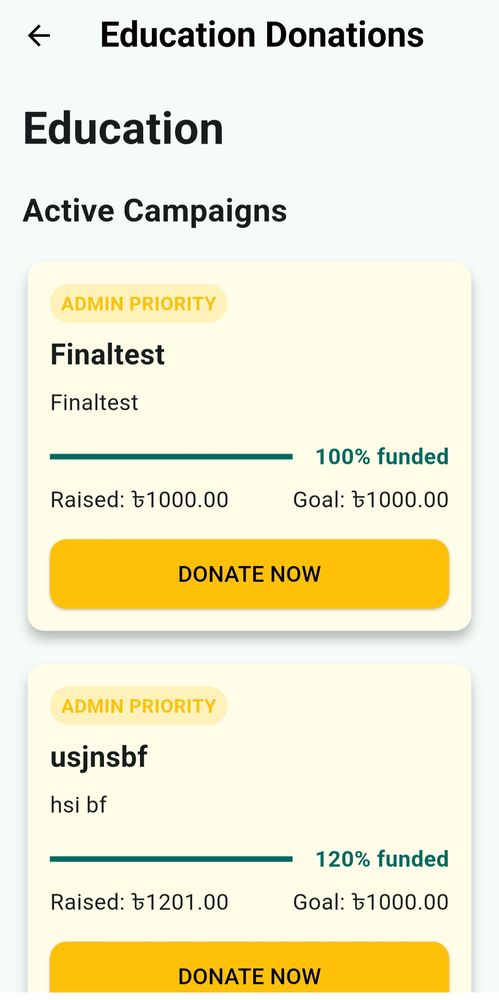
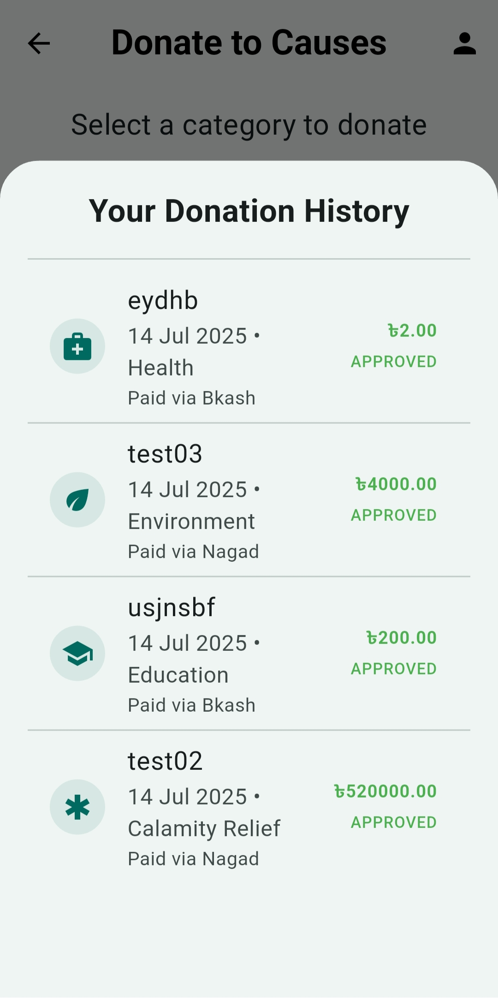

# Donatify User Manual  

## **Introduction** 💡  

Donatify is a fundraising platform connecting donors, receivers and administrators.

The app features: 

- **Multi-Role System**:  

  - 👥 **Donors**: Browse causes and donate securely  

  - 🏢 **Receivers**: Create/manage fundraising campaigns 

  - 🔒 **Admins**: Verify campaigns and monitor platform activity  

- **Secure Transactions**: Bkash/Nagad payment integration 

- **Real-Time Tracking**: Live donation progress and statistics  

---

## 🚀**Getting Started** 

### Step-1: Installation 

1. Install and launch app   

### Step-2: First-Time Setup  

1. **Role Selection:**  

   - Choose your role (Donor/Receiver/Admin)

   - **Note:** Admin requires pre-approved credentials  
   
     

2. **Registration:**  

   - Tap *Sign Up* (For Donors/Receivers only) 

   - Enter Name, email, password   

   

    

---

3. 💰**Donor Experience:**   

**Browsing Causes:**

1. Select category (e.g., **Education**)  

    

2. View active campaigns with progress bars

    

**Making Donations:**

1. Choose campaign → Tap **DONATE NOW**

   

2. Enter amount and select payment method: 

   - **Bkash**/**Nagad**  

     

**Viewing History:**

1. Tap profile icon (top-right)

2. See all donations with: 

   - Campaign name  

   - Date,amount 

   - Approval status

   - Payment status 

   
   
---

4. 🤝**Receiver Experience:** 

**Creating Campaigns:**

1. Tap ➕ icon (top-right)  

     

2. Fill details:

   - Title, Category, Target amount 

   - Detailed description 

3. Attach documents (PDF/PNG <5MB):

   - NGO registration  

   - Bank proof  

     

**Tracking Campaigns:**

- **Dashboard shows status:** 

  - 🟠 Pending: Under admin review 

  - 🟢 Approved: Accepted donations 

  - 🔴 Rejected: Rejected donations  

  

---

5. 🔒**Admin Experience:**  

**Reviewing Requests:**

1. Go to **Pending** tab

     

2. Review details/documents

3. Take action: 

   - ✅ **Approve** 

   - ❌ **Reject** 

   - ⭐ **Mark Important** (priority badge)  

     

**Monitoring Platform:**

- **Statistics Card:**

  - Today/This Week/This Month donations  

  - Total donations

    

- **Category Insights:**  

  - Health, Education, etc.(For Pending,Approved,Rejected) 

